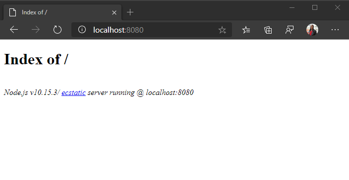

<!-- markdownlint-disable MD002 MD041 -->

最初に、プロジェクト用の空のディレクトリを作成します。 これは、HTTP サーバー、または開発コンピューター上のディレクトリにすることができます。 開発用コンピューター上にある場合は、テスト用にサーバーにコピーするか、開発用コンピューターで HTTP サーバーを実行する必要があります。 どちらの方法も使用していない場合は、次のセクションに指示が表示されます。

## <a name="start-a-local-web-server-optional"></a>ローカル web サーバーを開始する (オプション)

> [!NOTE]
> このセクションの手順では [Node.js](https://nodejs.org)必要があります。

このセクションでは、 [http-server](https://www.npmjs.com/package/http-server) を使用して、コマンドラインから簡単な http サーバーを実行します。

1. プロジェクト用に作成したディレクトリで、コマンドラインインターフェイス (CLI) を開きます。
1. 次のコマンドを実行して、そのディレクトリ内の web サーバーを起動します。

    ```Shell
    npx http-server -c-1
    ```

1. ブラウザーを開き、を参照し `http://localhost:8080` ます。

**/Page のインデックス** が表示します。 これにより、HTTP サーバーが実行中であることが確認されます。



## <a name="design-the-app"></a>アプリを設計する

このセクションでは、アプリケーション用の基本的な UI レイアウトを作成します。

1. プロジェクトのルートに **index.html** という名前の新しいファイルを作成し、次のコードを追加します。

    :::code language="html" source="../demo/graph-tutorial/index.html" id="indexSnippet":::

    これにより、ナビゲーションバーを含む、アプリの基本的なレイアウトが定義されます。 また、次の項目も追加されます。

    - [ブートストラップ](https://getbootstrap.com/) とそれをサポートする JavaScript
    - [FontAwesome](https://fontawesome.com/)
    - [Moment.js](https://momentjs.com/)
    - [JavaScript の Microsoft 認証ライブラリ (MSAL.js) 2.0](https://github.com/AzureAD/microsoft-authentication-library-for-js/tree/dev/lib/msal-browser)
    - [Microsoft Graph JavaScript クライアントライブラリ](https://github.com/microsoftgraph/msgraph-sdk-javascript)

    > [!TIP]
    > ページには、favicon () が含まれてい `<link rel="shortcut icon" href="g-raph.png">` ます。 この行を削除することも、 [GitHub](https://github.com/microsoftgraph/g-raph)から **g-raph.png** ファイルをダウンロードすることもできます。

1. **スタイル .css** という名前の新しいファイルを作成し、次のコードを追加します。

    :::code language="css" source="../demo/graph-tutorial/style.css":::

1. **auth.js** という名前の新しいファイルを作成し、次のコードを追加します。

    ```javascript
    function signIn() {
      // TEMPORARY
      updatePage({name: 'Megan Bowen', userName: 'meganb@contoso.com'});
    }

    function signOut() {
      // TEMPORARY
      updatePage();
    }
    ```

1. **ui.js** という名前の新しいファイルを作成し、次のコードを追加します。

    ```javascript
    // Select DOM elements to work with
    const authenticatedNav = document.getElementById('authenticated-nav');
    const accountNav = document.getElementById('account-nav');
    const mainContainer = document.getElementById('main-container');

    const Views = { error: 1, home: 2, calendar: 3 };

    function createElement(type, className, text) {
      var element = document.createElement(type);
      element.className = className;

      if (text) {
        var textNode = document.createTextNode(text);
        element.appendChild(textNode);
      }

      return element;
    }

    function showAuthenticatedNav(user, view) {
      authenticatedNav.innerHTML = '';

      if (user) {
        // Add Calendar link
        var calendarNav = createElement('li', 'nav-item');

        var calendarLink = createElement('button',
          `btn btn-link nav-link${view === Views.calendar ? ' active' : '' }`,
          'Calendar');
        calendarLink.setAttribute('onclick', 'getEvents();');
        calendarNav.appendChild(calendarLink);

        authenticatedNav.appendChild(calendarNav);
      }
    }

    function showAccountNav(user) {
      accountNav.innerHTML = '';

      if (user) {
        // Show the "signed-in" nav
        accountNav.className = 'nav-item dropdown';

        var dropdown = createElement('a', 'nav-link dropdown-toggle');
        dropdown.setAttribute('data-toggle', 'dropdown');
        dropdown.setAttribute('role', 'button');
        accountNav.appendChild(dropdown);

        var userIcon = createElement('i',
          'far fa-user-circle fa-lg rounded-circle align-self-center');
        userIcon.style.width = '32px';
        dropdown.appendChild(userIcon);

        var menu = createElement('div', 'dropdown-menu dropdown-menu-right');
        dropdown.appendChild(menu);

        var userName = createElement('h5', 'dropdown-item-text mb-0', user.displayName);
        menu.appendChild(userName);

        var userEmail = createElement('p', 'dropdown-item-text text-muted mb-0', user.mail || user.userPrincipalName);
        menu.appendChild(userEmail);

        var divider = createElement('div', 'dropdown-divider');
        menu.appendChild(divider);

        var signOutButton = createElement('button', 'dropdown-item', 'Sign out');
        signOutButton.setAttribute('onclick', 'signOut();');
        menu.appendChild(signOutButton);
      } else {
        // Show a "sign in" button
        accountNav.className = 'nav-item';

        var signInButton = createElement('button', 'btn btn-link nav-link', 'Sign in');
        signInButton.setAttribute('onclick', 'signIn();');
        accountNav.appendChild(signInButton);
      }
    }

    function showWelcomeMessage(user) {
      // Create jumbotron
      var jumbotron = createElement('div', 'jumbotron');

      var heading = createElement('h1', null, 'JavaScript SPA Graph Tutorial');
      jumbotron.appendChild(heading);

      var lead = createElement('p', 'lead',
        'This sample app shows how to use the Microsoft Graph API to access' +
        ' a user\'s data from JavaScript.');
      jumbotron.appendChild(lead);

      if (user) {
        // Welcome the user by name
        var welcomeMessage = createElement('h4', null, `Welcome ${user.displayName}!`);
        jumbotron.appendChild(welcomeMessage);

        var callToAction = createElement('p', null,
          'Use the navigation bar at the top of the page to get started.');
        jumbotron.appendChild(callToAction);
      } else {
        // Show a sign in button in the jumbotron
        var signInButton = createElement('button', 'btn btn-primary btn-large',
          'Click here to sign in');
        signInButton.setAttribute('onclick', 'signIn();')
        jumbotron.appendChild(signInButton);
      }

      mainContainer.innerHTML = '';
      mainContainer.appendChild(jumbotron);
    }

    function showError(error) {
      var alert = createElement('div', 'alert alert-danger');

      var message = createElement('p', 'mb-3', error.message);
      alert.appendChild(message);

      if (error.debug)
      {
        var pre = createElement('pre', 'alert-pre border bg-light p-2');
        alert.appendChild(pre);

        var code = createElement('code', 'text-break text-wrap',
          JSON.stringify(error.debug, null, 2));
        pre.appendChild(code);
      }

      mainContainer.innerHTML = '';
      mainContainer.appendChild(alert);
    }

    function updatePage(view, data) {
      if (!view) {
        view = Views.home;
      }

      const user = JSON.parse(sessionStorage.getItem('graphUser'));

      showAccountNav(user);
      showAuthenticatedNav(user, view);

      switch (view) {
        case Views.error:
          showError(data);
          break;
        case Views.home:
          showWelcomeMessage(user);
          break;
        case Views.calendar:
          break;
      }
    }

    updatePage(Views.home);
    ```

1. すべての変更を保存し、ページを更新します。 この時点で、アプリの外観は大きく異なります。

    
