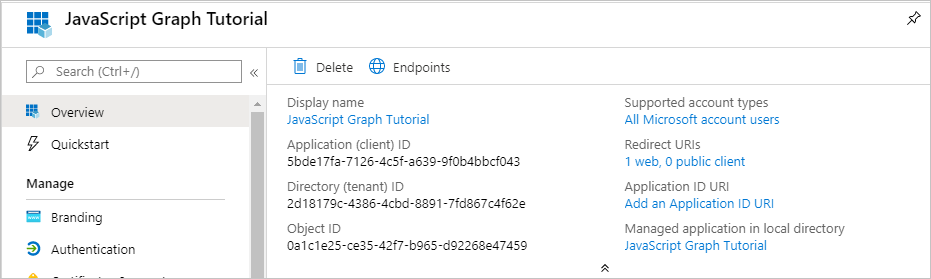

<!-- markdownlint-disable MD002 MD041 -->

この演習では、Azure Active Directory 管理センターを使用して、新しい Azure AD web アプリケーション登録を作成します。

1. ブラウザーを開き、[Azure Active Directory 管理センター](https://aad.portal.azure.com)に移動します。 **個人用アカウント** (別名: Microsoft アカウント)、または **職場/学校アカウント** を使用してログインします。

1. 左側のナビゲーションで **[Azure Active Directory]** を選択し、それから **[管理]** で **[アプリの登録]** を選択します。

    

    > [!NOTE]
    > Azure AD B2C ユーザーには、 **アプリの登録 (レガシー)** だけが表示されることがあります。 この場合は、に直接移動してください [https://aka.ms/appregistrations](https://aka.ms/appregistrations) 。

1. **[新規登録]** を選択します。 **[アプリケーションを登録]** ページで、次のように値を設定します。

    - `JavaScript Graph Tutorial` に **[名前]** を設定します。
    - **[サポートされているアカウントの種類]** を **[任意の組織のディレクトリ内のアカウントと個人用の Microsoft アカウント]** に設定します。
    - **[リダイレクト URI]** で、最初のドロップダウン リストを `Single-page application (SPA)` に設定し、それから `http://localhost:8080` に値を設定します。

    ![[アプリケーションを登録する] ページのスクリーンショット](./images/aad-register-an-app.png)

1. **[登録]** を選択します。 **JavaScript Graph のチュートリアル** ページで、 **アプリケーション (クライアント) ID** の値をコピーして保存します。次の手順で必要になります。

    
