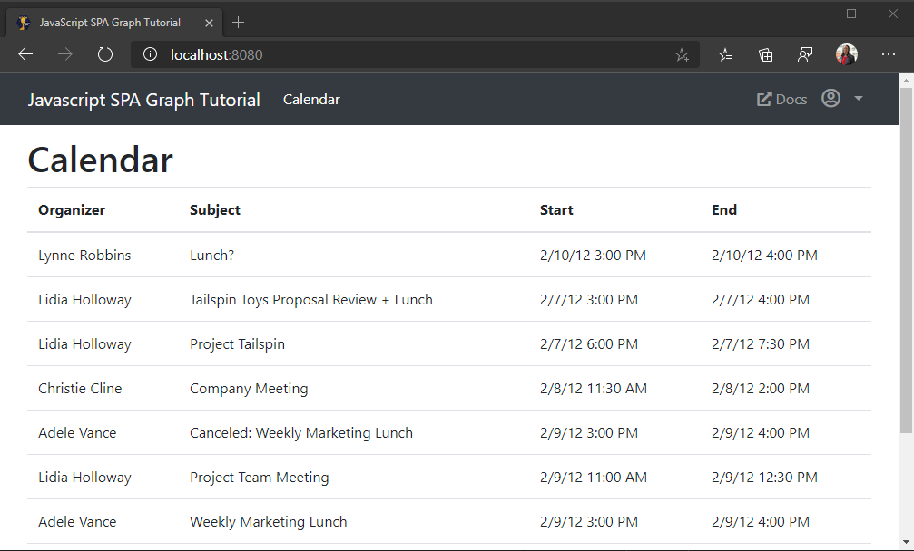

<!-- markdownlint-disable MD002 MD041 -->

<span data-ttu-id="5cd1e-101">この演習では、Microsoft Graph をアプリケーションに組み込みます。</span><span class="sxs-lookup"><span data-stu-id="5cd1e-101">In this exercise you will incorporate the Microsoft Graph into the application.</span></span> <span data-ttu-id="5cd1e-102">このアプリケーションでは、microsoft graph [JavaScript クライアントライブラリ](https://github.com/microsoftgraph/msgraph-sdk-javascript) ライブラリを使用して、microsoft graph を呼び出すことにします。</span><span class="sxs-lookup"><span data-stu-id="5cd1e-102">For this application, you will use the [Microsoft Graph JavaScript Client Library](https://github.com/microsoftgraph/msgraph-sdk-javascript) library to make calls to Microsoft Graph.</span></span>

## <a name="get-calendar-events-from-outlook"></a><span data-ttu-id="5cd1e-103">Outlook からカレンダー イベントを取得する</span><span class="sxs-lookup"><span data-stu-id="5cd1e-103">Get calendar events from Outlook</span></span>

<span data-ttu-id="5cd1e-104">このセクションでは、Microsoft Graph クライアントライブラリを使用して、ユーザーの予定表イベントを取得します。</span><span class="sxs-lookup"><span data-stu-id="5cd1e-104">In this section, you'll use the Microsoft Graph client library to get calendar events for the user.</span></span>

1. <span data-ttu-id="5cd1e-105">**timezones.js** という名前のプロジェクトのルートに新しいファイルを作成し、次のコードを追加します。</span><span class="sxs-lookup"><span data-stu-id="5cd1e-105">Create a new file in the root of the project named **timezones.js** and add the following code.</span></span>

    :::code language="javascript" source="../demo/graph-tutorial/timezones.js" id="zoneMappingsSnippet":::

    <span data-ttu-id="5cd1e-106">このコードでは、Windows タイムゾーン識別子を IANA タイムゾーン識別子にマップ moment.js との互換性を確保します。</span><span class="sxs-lookup"><span data-stu-id="5cd1e-106">This code maps Windows time zone identifiers to IANA time zone identifiers for compatibility with moment.js.</span></span>

1. <span data-ttu-id="5cd1e-107">**graph.js** に次の関数を追加します。</span><span class="sxs-lookup"><span data-stu-id="5cd1e-107">Add the following function to **graph.js**.</span></span>

    :::code language="javascript" source="../demo/graph-tutorial/graph.js" id="getEventsSnippet":::

    <span data-ttu-id="5cd1e-108">このコードの実行内容を考えましょう。</span><span class="sxs-lookup"><span data-stu-id="5cd1e-108">Consider what this code is doing.</span></span>

    - <span data-ttu-id="5cd1e-109">呼び出される URL は `/me/calendarview` です。</span><span class="sxs-lookup"><span data-stu-id="5cd1e-109">The URL that will be called is `/me/calendarview`.</span></span>
    - <span data-ttu-id="5cd1e-110">この `header` メソッドは、 `Prefer` ユーザーの優先タイムゾーンを指定するヘッダーを追加します。</span><span class="sxs-lookup"><span data-stu-id="5cd1e-110">The `header` method adds a `Prefer` header specifying the user's preferred time zone.</span></span>
    - <span data-ttu-id="5cd1e-111">この `query` メソッドは、予定表ビューの開始時刻と終了時刻を追加します。</span><span class="sxs-lookup"><span data-stu-id="5cd1e-111">The `query` method adds the start and end times for the calendar view.</span></span>
    - <span data-ttu-id="5cd1e-112">`select`このメソッドは、各イベントに対して返されるフィールドを、ビューが実際に使用するものだけに制限します。</span><span class="sxs-lookup"><span data-stu-id="5cd1e-112">The `select` method limits the fields returned for each events to just those the view will actually use.</span></span>
    - <span data-ttu-id="5cd1e-113">メソッドは、 `orderby` 開始時刻で結果を並べ替えます。最も古いイベントは最初になります。</span><span class="sxs-lookup"><span data-stu-id="5cd1e-113">The `orderby` method sorts the results by the start time, with the earliest event being first.</span></span>
    - <span data-ttu-id="5cd1e-114">メソッドは、 `top` 応答で最大50イベントを要求します。</span><span class="sxs-lookup"><span data-stu-id="5cd1e-114">The `top` method requests up to 50 events in the response.</span></span>

1. <span data-ttu-id="5cd1e-115">**ui.js** を開いて、次の関数を追加します。</span><span class="sxs-lookup"><span data-stu-id="5cd1e-115">Open **ui.js** and add the following function.</span></span>

    ```javascript
    function showCalendar(events) {
      // TEMPORARY
      // Render the results as JSON
      var alert = createElement('div', 'alert alert-success');

      var pre = createElement('pre', 'alert-pre border bg-light p-2');
      alert.appendChild(pre);

      var code = createElement('code', 'text-break',
        JSON.stringify(events, null, 2));
      pre.appendChild(code);

      mainContainer.innerHTML = '';
      mainContainer.appendChild(alert);
    }
    ```

1. <span data-ttu-id="5cd1e-116">`switch`ビューがである場合に呼び出す関数のステートメントを更新 `updatePage` `showCalendar` `Views.calendar` します。</span><span class="sxs-lookup"><span data-stu-id="5cd1e-116">Update the `switch` statement in the `updatePage` function to call `showCalendar` when the view is `Views.calendar`.</span></span>

    :::code language="javascript" source="../demo/graph-tutorial/ui.js" id="updatePageSnippet" highlight="18-20":::

1. <span data-ttu-id="5cd1e-117">変更を保存し、アプリを更新します。</span><span class="sxs-lookup"><span data-stu-id="5cd1e-117">Save your changes and refresh the app.</span></span> <span data-ttu-id="5cd1e-118">サインインして、ナビゲーションバーの [ **予定表** ] リンクをクリックします。</span><span class="sxs-lookup"><span data-stu-id="5cd1e-118">Sign in and click the **Calendar** link in the nav bar.</span></span> <span data-ttu-id="5cd1e-119">すべてが正常に機能していれば、ユーザーのカレンダーにイベントの JSON ダンプが表示されます。</span><span class="sxs-lookup"><span data-stu-id="5cd1e-119">If everything works, you should see a JSON dump of events on the user's calendar.</span></span>

## <a name="display-the-results"></a><span data-ttu-id="5cd1e-120">結果の表示</span><span class="sxs-lookup"><span data-stu-id="5cd1e-120">Display the results</span></span>

<span data-ttu-id="5cd1e-121">このセクションでは、関数を更新して、 `showCalendar` よりわかりやすい方法でイベントを表示します。</span><span class="sxs-lookup"><span data-stu-id="5cd1e-121">In this section you will update the `showCalendar` function to display the events in a more user-friendly manner.</span></span>

1. <span data-ttu-id="5cd1e-122">既存の `showCalendar` 関数を、以下の関数で置き換えます。</span><span class="sxs-lookup"><span data-stu-id="5cd1e-122">Replace the existing `showCalendar` function with the following.</span></span>

    :::code language="javascript" source="../demo/graph-tutorial/ui.js" id="showCalendarSnippet":::

    <span data-ttu-id="5cd1e-123">これにより、イベントのコレクションがループ処理され、テーブル行が1つずつ追加されます。</span><span class="sxs-lookup"><span data-stu-id="5cd1e-123">This loops through the collection of events and adds a table row for each one.</span></span>

1. <span data-ttu-id="5cd1e-124">変更を保存し、アプリを更新します。</span><span class="sxs-lookup"><span data-stu-id="5cd1e-124">Save the changes and refresh the app.</span></span> <span data-ttu-id="5cd1e-125">[ **予定表** ] リンクをクリックすると、現在の週のイベントの表が表示されるようになります。</span><span class="sxs-lookup"><span data-stu-id="5cd1e-125">Click on the **Calendar** link and the app should now render a table of events for the current week.</span></span>

    
