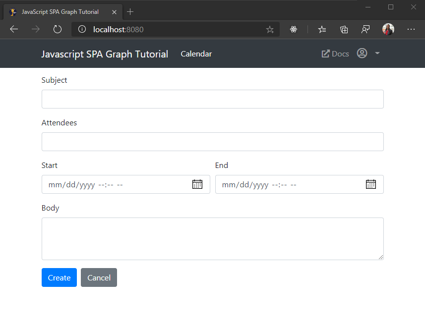

<!-- markdownlint-disable MD002 MD041 -->

このセクションでは、ユーザーの予定表にイベントを作成する機能を追加します。In this section you will add the ability to create events on the user's calendar.

## 新しいイベントフォームを作成するCreate a new event form

1. 次の関数を **ui.js** に追加して、新しいイベントのフォームをレンダリングします。Add the following function to **ui.js** to render a form for the new event.

    :::code language="javascript" source="../demo/graph-tutorial/ui.js" id="showNewEventFormSnippet":::

## イベントを作成するCreate the event

1. 次の関数を **graph.js** に追加して、フォームから値を読み取り、新しいイベントを作成します。Add the following function to **graph.js** to read the values from the form and create a new event.

    :::code language="javascript" source="../demo/graph-tutorial/graph.js" id="createEventSnippet":::

1. 変更を保存し、アプリを更新します。Save your changes and refresh the app. [ **予定表** ] ナビゲーション項目をクリックし、[ **イベントの作成** ] ボタンをクリックします。Click the **Calendar** nav item, then click the **Create event** button. 値を入力し、[ **作成** ] をクリックします。Fill in the values and click **Create**. 新しいイベントが作成されると、アプリは [予定表] ビューに戻ります。The app returns to the calendar view once the new event is created.

    
